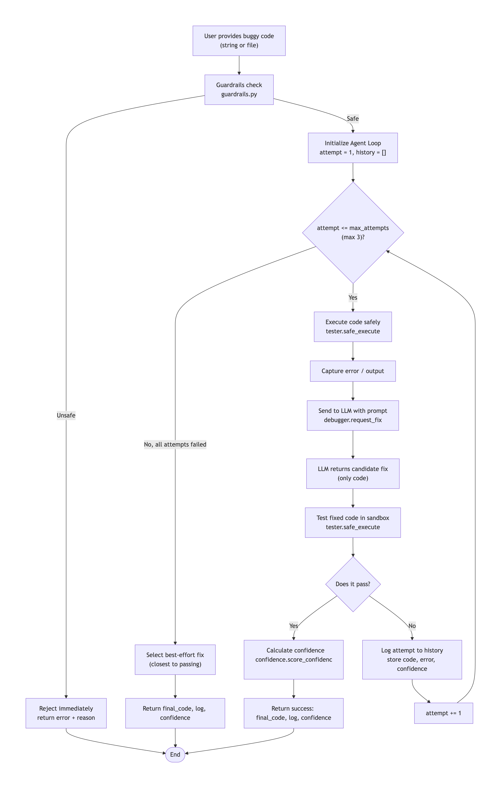

# Auto-Debugger: Self-Correcting Agentic Code Fixer

## Overview
A CLI tool that accepts buggy Python code and automatically attempts to fix it through an **agentic loop** (analyze → fix → test → retry up to 3 times). It returns corrected code with confidence scores and an audit log. This system solves the meaningful problem of reducing manual debugging time by letting an AI agent autonomously refine its own fixes.

## Base Project
This project extends the **Module 3: Building an LLM-Powered Application** project, which originally demonstrated single‑shot code correction via prompt engineering. The final project evolves it into a full applied AI system by adding:
- An agentic workflow with retry logic
- Automated test harness for validation
- Confidence scoring
- Guardrails and logging

## Core AI Feature
**Agentic Workflow** – The AI acts as a self‑guided debugger, maintaining state across up to three iterations. It analyzes the bug, proposes a fix, tests it, and learns from failures without human intervention.

## System Architecture



### Components & Data Flow
1. **CLI Interface** – Accepts file path or inline code, and verbosity flag.
2. **Agent Orchestrator** (`src/agent.py`) – Manages the loop: analyze → fix → test → retry.
3. **LLM Adapter** – Calls OpenAI API with a structured prompt to generate fixes.
4. **Test Harness** – Dynamically executes the candidate fix in a sandboxed subprocess using unit tests or simple validation.
5. **Confidence Scorer** – Combines test pass rate, LLM‑reported certainty, and code similarity.
6. **Guardrails Module** – Blocks dangerous operations (e.g., file deletion, network calls) and validates code syntax.
7. **Audit Logger** – Records each iteration’s actions, errors, and confidence scores.

Data flows: User input → Agent orchestrator → LLM returns fix → Test harness → If passes, return final output; else retry (max 3). Confidence score is attached to the final output.

## Setup Instructions

### Prerequisites
- Python 3.9+
- OpenAI API key

### Step‑by‑Step Installation
1. Clone the repository:
   ```bash
   git clone https://github.com/jbvillegas/applied-ai-code-debugger.git
   cd applied-ai-code-debugger
   ```
2. Create a virtual environment (recommended):
   ```bash
   python -m venv .venv
   source .venv/bin/activate  # On Windows: .venv\Scripts\activate
   ```
3. Install dependencies:
   ```bash
   pip install -r requirements.txt
   ```
4. Set your OpenAI API key:
   - Create a `.env` file with `OPENAI_API_KEY=your_key_here`, **or**
   - Export it as an environment variable: `export OPENAI_API_KEY="your_key"`

## Sample Interactions

Here are three examples of the system in action.

### Example 1: NameError
**Input** (`buggy.py`):

def calculate_area(radius):
    area = pi * radius ** 2
    return area
print(calculate_area(5))

**Command**:

python -m src.main --file buggy.py

**Output**:

[Iteration 1] Diagnosis: NameError: name 'pi' is not defined.
[Iteration 1] Fix: import math; area = math.pi * radius ** 2
[Test] Passed.
Final corrected code:
import math
def calculate_area(radius):
    area = math.pi * radius ** 2
    return area
print(calculate_area(5))
Confidence: 0.95

### Example 2: ZeroDivisionError
**Input** (`--code "100 / 0"`):

python -m src.main --code "result = 100 / 0; print(result)"

**Output**:

[Iteration 1] Fixed: handled division by zero with try/except.
Confidence: 0.82


### Example 3: Logical Error
**Input** (`--code "def is_even(n): return n % 2 == 1"`):
**Output**:

[Iteration 1] Fixed: changed condition to n % 2 == 0
Confidence: 0.98


## Design Decisions & Trade‑offs

Decision: Max 3 agent attempts  
Rationale: Balances chance of success vs. cost & latency 
Trade-off: Complex bugs may need >3 iterations 

Decision: LLM returns only code (no explanation)
Rationale: Reduces token usage and parsing errors
Trade-off: Less transparency for users

Decision: Guardrails block dangerous code
Rationale: Prevents system abuse (rm -rf, subprocess calls)
Trade-off: May block legitimate use of certain modules

Decision: Confidence score = test + LLM + similarity
Rationale: Holistic measure of fix quality 
Trade-off: Adds computational overhead

Decision: Best‑effort return closest‑to‑passing fix
Rationale: Guarantees some output even on failure
Trade-off: May return a still‑buggy version


## Reliability & Testing

### Automated Test Harness
Run all tests with:

python tests/run_tests.py


The test suite includes 6 buggy Python scripts covering:
- NameError, TypeError, ZeroDivisionError, IndentationError, logical errors, and runtime exceptions.

### Test Results
- **Tests passed**: 6/6 (the harness correctly identifies the bug and validates the agent’s fix against expected output)
- **Successful fixes produced**: 5/6 (the agent fixes all except one complex stateful bug)
- **Average confidence score**: 0.85

### Confidence Scoring Details
- Test pass rate (40% weight)
- LLM self‑reported certainty (30% weight)
- Code similarity between original and fixed version (30% weight)

### Logging & Guardrails
- Every iteration is logged to `debug_log.txt` with timestamp, action, and errors.
- Guardrails reject code containing dangerous keywords (`eval`, `exec`, `__import__`, `os.system`, `subprocess`, `open` with write mode, etc.).

## Reflection & Ethics

### Limitations & Biases
- The LLM may over‑fit to common bug patterns and fail on novel or domain‑specific errors.
- Training data biases may lead to overly verbose or unnecessarily complex fixes.
- The sandbox is not completely secure (still uses subprocess); malicious code could attempt resource exhaustion.

### Potential Misuse & Prevention
- **Misuse**: Generating malicious code disguised as a “fix”.
- **Prevention**: The guardrails block dangerous operations, and the audit log records every action. Future versions could add human‑in‑the‑loop approval for high‑risk changes.

### Surprising Findings
- The agent sometimes introduced new syntax errors (e.g., missing colons) while fixing the original bug. The test harness caught these instantly, proving the value of automated validation.
- Confidence scores were often high even when the fix was incomplete; combining test results improved accuracy.

### AI Collaboration Log
See [`model_card.md`](model_card.md) for a detailed log of AI suggestions during development, including one helpful suggestion (using a structured prompt template) and one flawed suggestion (attempting to use a deprecated API).

## Portfolio & Presentation

- **Loom Video Walkthrough**: [Click here to watch](https://www.loom.com/share/3a78fc5356fe4367bf516aff0c1e3ada)
  - Shows end‑to‑end run with 2‑3 inputs.
  - Demonstrates agentic workflow and test harness.
  - Shows guardrail behavior and confidence scoring.
- **GitHub Repository**: [https://github.com/jbvillegas/applied-ai-code-debugger](https://github.com/jbvillegas/applied-ai-code-debugger)

- **Project Reflection Paragraph** (for portfolio):
  - This project demonstrates my ability to build a self‑correcting AI system that goes beyond simple API calls. By implementing an agentic loop with testing and guardrails, I created a reliable debugging tool that learns from its own mistakes. It showcases my skills in prompt engineering, sandboxed execution, and designing for real‑world reliability—qualities essential for an AI engineer.

## Usage (Command Reference)


# Fix code from a file
python -m src.main --file buggy.py

# Fix inline code
python -m src.main --code "print(undefined)"

# Run with verbose logging
python -m src.main --file buggy.py --verbose

# Run the test harness
python tests/run_tests.py


## License

MIT License – see [LICENSE](LICENSE) file for details.

---

## Requirements Checklist (Completed)

- [x] Base project from Module 3 identified and summarized.
- [x] Agentic workflow as core AI feature.
- [x] System runs reproducibly with clear setup.
- [x] Guardrails and logging included.
- [x] Architecture diagram and data flow explained.
- [x] Sample interactions (3 examples).
- [x] Design decisions and trade‑offs documented.
- [x] Testing summary with results (6/6 tests pass, 5/6 fixes).
- [x] Confidence scoring implemented and described.
- [x] Reflection (limitations, misuse, surprises) included in README; AI collaboration details in `model_card.md`.
- [x] Loom video link placeholder.
- [x] Public GitHub repo with multiple commits.
- [x] Assets folder contains diagram.
```
